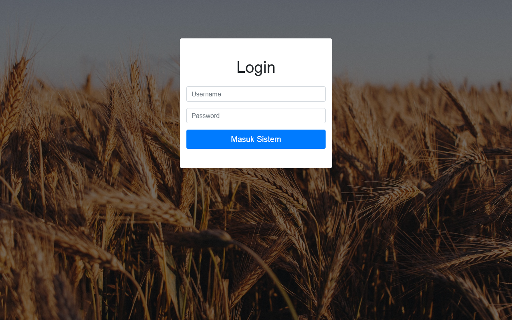

# Gandum CBR Project - A Web Application Determines Wheat Disease

Created with PHP and Bootstrap CSS.

## Description

The project is about determine what disease does wheat plant have based on their symptoms.
The user input the characteristics that plant have and the system suggests the result of disease does plant got.

## Tech Stack

- PHP
- Bootstrap CSS

## Screenshot

Login Page

Dashboard Page

Wheat Disease Cases Page

Lists of Wheat Disease Page

Lists of Symptoms Page

Form Input New Case Page

Display Conclusion of the disease Page

## Date Launch

This repo has been completed on December, 2020.
